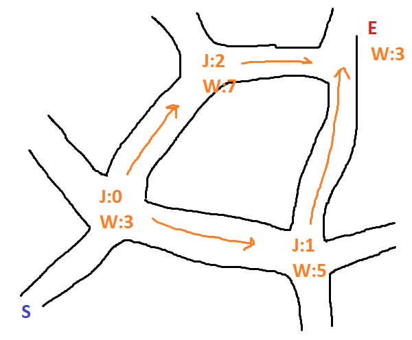

[](https://crates.io/crates/pathfinding_astar)
[](https://docs.rs/pathfinding_astar)

# pathfinding_astar

This is an enhancement and generalisation of my [previous work](https://github.com/BlondeBurrito/hexagonal_pathfinding_astar) with the A-Star pathfinding algorithm.

The key difference is that with my hexagonal work the library was responsible for determining valid neighbouring nodes for path traversal whereby the user has to target a particular coordinate system and specify the bounds of their hexagonal space. For instance working with Offset geometries you could use the following to return the best path:

```rust
let start_node: (i32, i32) = (0, 0);
let mut nodes: HashMap<(i32, i32), f32> = HashMap::new();
nodes.insert((0, 0), 1.0);
// snip inserting all the nodes
let end_node: (i32, i32) = (3, 3);
let min_column = -1;
let max_column = 4;
let min_row = -1;
let max_row = 4;
let orientation = HexOrientation::FlatTopOddUp;
let path = astar_path(
    start_node,
    nodes,
    end_node,
    min_column,
    max_column,
    min_row,
    max_row,
    orientation,
);
```

As you can see there are `min` and `max` bounds which must be supplied as well as an orientation (are your hexagons flat topped or pointy topped? Which column/row has been shifted to allow for flush tesselation?).

This new approach is intended to work with any arrangment of 'travel points' or nodes. Achieving this involves using a data structure whereby a node has knowledge of what its neighbours are and how far away they are, rather than the library calculating these on the fly - which means it is applicable for a number of geometires and abstract routes.

## What Is A-Star? <a name="astar"></a>

For a number of interconnected nodes A-Star involves using what's called a heuristic (referred to as weight `W`) to guide the calculations so that an optimal path from one point to another can be found quickly.

If we take a starting point `S` and wish to move to end point `E` we have two paths we could choose to traverse, to `O1` or to `O2`.

```txt
                        Length:22             W:4
                 S ----------------------> O1
                 |                         |
                 |                         |
        Length:5 |                         | Length:4
                 |                         |
                 ▼                         ▼
                 O2 ---------------------> E
            W:1          Length:20            W:2
```

Each point has an associated weight `W` which is a general measure designed to guide the algorithm.

To find the opitmal path we discover the available routes from our starting point `S`, the distance from `S` to a given point and create an A-Star score for moving along a path. For instance:

* The distance between `S` and `O1` is `22`
* The A-Star score of moving from `S` to `O1` is the sum of the distance moved with the weight of the point, i.e `22 + 4 = 26`

We then consider the alternate route of moving from `S` to `O2`:

* The distance between `S` and `O2` is `5`
* The A-Star score is therefore `5 + 1 = 6`

We can see that currently the most optimal route is to move from `S` to `O2` (it has a lower A-Star score) - as moving to `O2` has a better A-Star score we interrogate this point first.

From `O2` we discover that we can traverse to `E`:

* The overall disatnce covered is now `20 + 5 = 25`
* The A-Star score is the sum of the overall distance and the weight of `E`, `25 + 2 = 27`

So far we have explored:

* `S` to `O1` with an A-Star score of `26`
* `S` to `O2` to `E` with an A-Star score of `27`

As we still have a route avaiable with a better A-Star score we expand it, `O1` to `E`:

* Overall distance `22 + 4 = 26`
* The A-Star score is `26 + 2 = 28`

In this simple use case we have expored all paths and found the final scores to be:

* `S` to `O1` to `E` with an A-Star score of `28`
* `S` to `O2` to `E` with an A-Star score of `27`

Now we know which path is better, moving via `O2` has a better final A-Star score (it is smaller).

The idea is that for a large number of points and paths certain routes will not be explored as they'd have much higher A-Star scores, this cuts down on search time.

## Using This Library

Given a collection of nodes you can find the most optimal route from one node to another (if it exists) by providing:

* Your starting node
* Your end or target node
* A map of nodes containing their weight heuristic and what neighbours they have with the respective distances to each one.
  * Note that weight is setup such that large weight values indicate a difficult node to traverse

If a route does not exist the library will return `None`, otherwise you'll have `Some(Vec<T>)` containing the node labels of the best path, where the type `T` corresponds to what you've used to uniquely label your nodes. Note `T` must implement the `Eq`, `Hash`, `Debug`, `Copy` and `Clone` traits, typically I use `i32` or `(i32, i32)` as labels which satisfy this.

Note that if your node weightings are very similar then the algorithm may give you the second or third highly optimal path rather than the best, tuning your weightings is how to ensure the best result but in most cases the second/third route is good enough - this arises from cases where multiple nodes end up having the same A-Star score and the first one of them which gets processed in turn generates a good A-Star score for your end node and that is returned.

So in general choose a type `T` to label each of your nodes, specify your starting node and ending node, and along with a map of all your nodes you can find a path with the following function:

```rust
pub fn astar_path<T>(
	start_node: T,
	nodes: HashMap<T, (Vec<(T, f32)>, f32)>,
	end_node: T,
) -> Option<Vec<T>>
```

Where `nodes` must also contain your `start_node` and `end_node`. The `HashMap` keys are also your chosen label to uniquely identify nodes and the value tuple has two parts:

* A vector of neighbours with the same type label and the distance between that neighbour and the current key as an `f32`
* An `f32` weighting for the node which will guide the algorithm

When working with grids like:

```txt
________________________
| L:12| L:13| L:14| L:15|
| W:5 | W:8 | W:9 | W:4 |
|_____|_____|_____|_____|
| L:8 | L:9 | L:10| L:11|
| W:1 | W:1 | W:4 | W:3 |
|_____|_____|_____|_____|
| L:4 | L:5 | L:6 | L:7 |
| W:1 | W:9 | W:14| W:6 |
|_____|_____|_____|_____|
| L:0 | L:1 | L:2 | L:3 |
| W:1 | W:7 | W:3 | W:7 |
|_____|_____|_____|_____|
```

The square labelled `L:0` would need to know about it's neighbours `L:1` and `L:4`, in terms of data we can express this as:

```rust
let start: i32 = 0;
let end: i32 = 15;
// Keys are the labels to uniquely identify a node
// Values contain a vec of neighbours you can move to with the distance to them, and an `f32` to weight to node.
// Note the distance from one square to its neighbour is the same so in our Vec tuple we use the unit distance `1.0`
let mut nodes: HashMap<i32, (Vec<(i32, f32)>, f32)> = HashMap::new();
// Node L:0 has neighbours L:4 with distance 1.0 and L:1 with distance 1.0, and a weight of 1.0
nodes.insert(0, (vec![(4, 1.0), (1, 1.0)], 1.0));
// Node L:1 has 3 neighbours and is itself weighted 7.0
nodes.insert(1, (vec![(5, 1.0), (2, 1.0), (0, 1.0)], 7.0));
nodes.insert(2, (vec![(6, 1.0), (3, 1.0), (1, 1.0)], 3.0));
// snip - the rest of this data is in the test `grid_like_path()`
let path = astar_path(start, nodes, end).unwrap();
let actual = vec![0, 4, 8, 9, 10, 11, 15];
assert_eq!(actual, path);
```

Similarly this library can be applied to hexagonal space provided you know the data upfront about which hexagons border another one.

```txt
             _______
            /   0   \
    _______/         \_______
   /  -1   \       1 /   1   \
  /         \_______/         \
  \       1 /   q   \       0 /
   \_______/         \_______/
   /  -1   \       r /   1   \
  /         \_______/         \
  \       0 /   0   \      -1 /
   \_______/         \_______/
           \      -1 /
            \_______/
```

Representing a node and it's possible neighbours with a `(q, r)` like (axial) label:

```rust
let mut nodes: HashMap<(i32, i32), (Vec<((i32, i32), f32)>, f32)> = HashMap::new();
nodes.insert((0, 0), (vec![((0, 1), 1.0), ((1, 0), 1.0), ((1, -1), 1.0), ((0, -1), 1.0), ((-1, 0), 1.0), ((-1, 1), 1.0)], 1.0));
// snip
```

Again the distance from the center of one hexagon to another is always the same so we have used the unit distance `1.0`.

And finally it can be applied to more abstract spaces, consider the following roads:



Externally you could use some data to calculate the weight of each junction/road based on traffic levels and provided you know the length of each road you could calculate the best path from `S` to `E` - just like a SatNav device.

Taking it a step further you could make weight a composite value where you calculate it based on many different factors, for instance you could consider different types of road being limited by speed and having different levels of traffic:

```rust
let dirt_road_base_weight = 13.0; // slow
let main_road_base_weight = 5.0;  // fast

let dirt_road_traffic_weight = 4.0; // less busy
let main_road_traffic_weight = 15.0; // very busy

let dirt_road_weight = dirt_road_base_weight + dirt_road_traffic_weight;
let main_road_weight = main_road_base_weight + main_road_traffic_weight;
```
